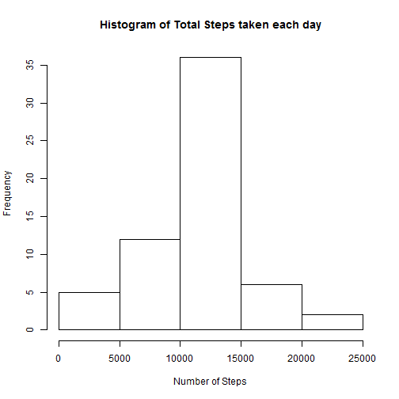

##Introduction

It is now possible to collect a large amount of data about personal movement using activity monitoring devices such as a Fitbit, Nike Fuelband, or Jawbone Up. These type of devices are part of the "quantified self" movement - a group of enthusiasts who take measurements about themselves regularly to improve their health, to find patterns in their behavior, or because they are tech geeks. But these data remain under-utilized both because the raw data are hard to obtain and there is a lack of statistical methods and software for processing and interpreting the data.


This assignment makes use of data from a personal activity monitoring device. This device collects data at 5 minute intervals through out the day. The data consists of two months of data from an anonymous individual collected during the months of October and November, 2012 and include the number of steps taken in 5 minute intervals each day.

##Data

The assignment uses [Activity Monitoring Data] [1]

The variables included in this dataset are:

- steps: Number of steps taking in a 5-minute interval (missing values are coded as NA)

- date: The date on which the measurement was taken in YYYY-MM-DD format

- interval: Identifier for the 5-minute interval in which measurement was taken

The dataset is stored in a comma-separated-value (CSV) file and there are a total of 17,568 observations in this dataset.

##Loading and preprocessing the data

Assuming the data file exists in the current working directory.


```r
activity <- read.csv("activity.csv")

#Converting the "date" column to type = date using the 'Lubridate' package
library(lubridate)
activity$date <- ymd(activity$date)
head(activity,10)
```

```
##    steps       date interval
## 1     NA 2012-10-01        0
## 2     NA 2012-10-01        5
## 3     NA 2012-10-01       10
## 4     NA 2012-10-01       15
## 5     NA 2012-10-01       20
## 6     NA 2012-10-01       25
## 7     NA 2012-10-01       30
## 8     NA 2012-10-01       35
## 9     NA 2012-10-01       40
## 10    NA 2012-10-01       45
```

###What is the mean total number of steps taken per day?


Calculating the total steps taken each day and plotting a histogram for the same:


```r
#Subsetting the original dataset to include only complete cases
tot_steps <- activity[!is.na(activity$steps),]

#Summarizing using "Dplyr" package
library(dplyr)
tot_steps <- aggregate(tot_steps$steps ~ tot_steps$date,FUN = sum)
names(tot_steps) <- c("date","steps")
head(tot_steps,10)
```

```
##          date steps
## 1  2012-10-02   126
## 2  2012-10-03 11352
## 3  2012-10-04 12116
## 4  2012-10-05 13294
## 5  2012-10-06 15420
## 6  2012-10-07 11015
## 7  2012-10-09 12811
## 8  2012-10-10  9900
## 9  2012-10-11 10304
## 10 2012-10-12 17382
```

```r
#Plotting  using the base plotting system
hist(tot_steps[[2]], main = "Histogram of Total Steps taken each day", xlab = "Number of Steps")
```

 


###What is the mean and median of the total number of steps taken per day?


```r
mean_tot_steps <- mean(tot_steps$steps)
print(mean_tot_steps)
```

```
## [1] 10766.19
```

```r
median_tot_steps <- median(tot_steps$steps)
print(median_tot_steps)
```

```
## [1] 10765
```


###What is the average daily activity pattern?


```r
#Averaging the total steps by interval across all days
steps_interval <- aggregate(activity$steps ~ activity$interval, FUN = mean, na.rm = T)
names(steps_interval) <- c("interval", "steps")
head(steps_interval,10)
```

```
##    interval     steps
## 1         0 1.7169811
## 2         5 0.3396226
## 3        10 0.1320755
## 4        15 0.1509434
## 5        20 0.0754717
## 6        25 2.0943396
## 7        30 0.5283019
## 8        35 0.8679245
## 9        40 0.0000000
## 10       45 1.4716981
```

```r
#Plotting a timeseries to show this variation using ggplot system
library(ggplot2)
ggplot(steps_interval, aes(interval, steps))+ geom_line(ch = 4)+ ylab("Average steps averaged across all days")+ xlab("Interval")
```

 


###Which 5-minute interval, on average across all the days in the dataset, contains the maximum number of steps?


```r
steps_interval[steps_interval$step == max(steps_interval$steps),]
```

```
##     interval    steps
## 104      835 206.1698
```


###Total number of missing values ('NA') in the data set


```r
sum(is.na(activity$steps))
```

```
## [1] 2304
```


###Filling the missing vaues


Any missing value in the activity dataset for a particular 5 min interval is replaced by the mean of the available values for that interval.


```r
activity2 <- activity
activity2$steps[is.na(activity2$steps) & activity2$interval==steps_interval$interval] <- steps_interval$steps
head(activity2,10)
```

```
##        steps       date interval
## 1  1.7169811 2012-10-01        0
## 2  0.3396226 2012-10-01        5
## 3  0.1320755 2012-10-01       10
## 4  0.1509434 2012-10-01       15
## 5  0.0754717 2012-10-01       20
## 6  2.0943396 2012-10-01       25
## 7  0.5283019 2012-10-01       30
## 8  0.8679245 2012-10-01       35
## 9  0.0000000 2012-10-01       40
## 10 1.4716981 2012-10-01       45
```


###Histogram for total steps per day with missing values filled in


```r
tot_steps2 <- aggregate(activity2$steps ~ activity2$date,FUN = sum)

#Plotting using the base plotting system
hist(tot_steps2[[2]], main = "Histogram of Total Steps taken each day", xlab = "Number of Steps")
```

 


The above histogram is different from the one obtained before, emphasizing the inevitable effect of missing values on the total number of steps taken each day.

It can be seen that the maximum frequency has gone up by about 10, thus depiciting a better picture of the activity of the subject.

**Note: All further computations have been performed on the modified dataset i.e. the one with the missing values filled in.**


###Are there differences in activity patterns between weekdays and weekends?

Creating a new factor variable in the dataset with two levels -- "weekday" and "weekend" indicating whether a given date is a weekday or weekend day.


```r
activity2$day <- weekdays(activity2$date)
week <- unique(activity2$day)

#Separating the weekends from weekdays
week <- week[c(-6,-7)]

#Assigning weekday/weekend label
activity2$day_type[activity2$day == "Saturday" | activity2$day == "Sunday"] <- "weekend"
activity2$day_type[is.na(activity2$day_type)] <- "weekday"
activity2 <- activity2[,-4]
head(activity2,10)
```

```
##        steps       date interval day_type
## 1  1.7169811 2012-10-01        0  weekday
## 2  0.3396226 2012-10-01        5  weekday
## 3  0.1320755 2012-10-01       10  weekday
## 4  0.1509434 2012-10-01       15  weekday
## 5  0.0754717 2012-10-01       20  weekday
## 6  2.0943396 2012-10-01       25  weekday
## 7  0.5283019 2012-10-01       30  weekday
## 8  0.8679245 2012-10-01       35  weekday
## 9  0.0000000 2012-10-01       40  weekday
## 10 1.4716981 2012-10-01       45  weekday
```


Highlighting the activity differences on weekends and weekdays by a timeseries plot:


```r
activity2$day_type <- as.factor(activity2$day_type)

#Taking averages of total steps in a particular 5 min interval for weekdays and weekends separately
steps_interval2 <- with(activity2,tapply(steps,list(interval,day_type),mean,simplify = T))
steps_interval2 <- as.data.frame(steps_interval2)
steps_interval2$interval <- unique(activity2$interval)
head(steps_interval2,10)
```

```
##       weekday     weekend interval
## 0  2.25115304 0.214622642        0
## 5  0.44528302 0.042452830        5
## 10 0.17316562 0.016509434       10
## 15 0.19790356 0.018867925       15
## 20 0.09895178 0.009433962       20
## 25 1.59035639 3.511792453       25
## 30 0.69266247 0.066037736       30
## 35 1.13794549 0.108490566       35
## 40 0.00000000 0.000000000       40
## 45 1.79622642 0.558962264       45
```

```r
#Converting this wide dataset to long dataset using the 'Tidyr' package
library(tidyr)
steps_interval2 <- steps_interval2%>% gather(day_type,steps,-interval)
head(steps_interval2,10)
```

```
##    interval day_type      steps
## 1         0  weekday 2.25115304
## 2         5  weekday 0.44528302
## 3        10  weekday 0.17316562
## 4        15  weekday 0.19790356
## 5        20  weekday 0.09895178
## 6        25  weekday 1.59035639
## 7        30  weekday 0.69266247
## 8        35  weekday 1.13794549
## 9        40  weekday 0.00000000
## 10       45  weekday 1.79622642
```

```r
#Plotting using ggplot2
ggplot(steps_interval2, aes(interval, steps)) + geom_line(ch = 4) + ylab("Average steps averaged across all weekdays/weekends") + xlab("Interval") + facet_grid(day_type~.)
```

 


[1]:https://d396qusza40orc.cloudfront.net/repdata%2Fdata%2Factivity.zip/ "Activity Monitoring Data"
